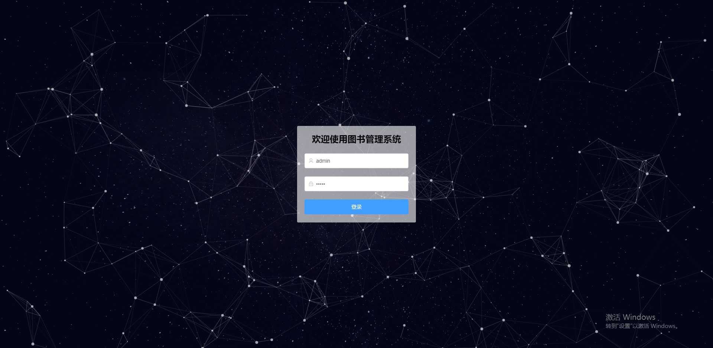
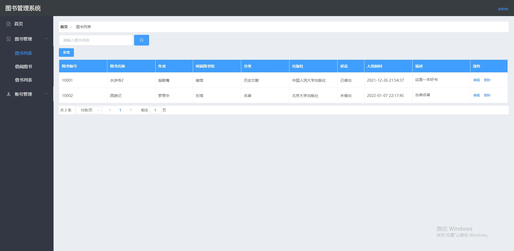
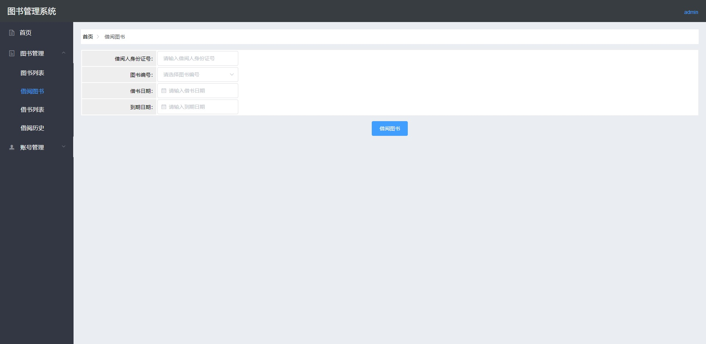
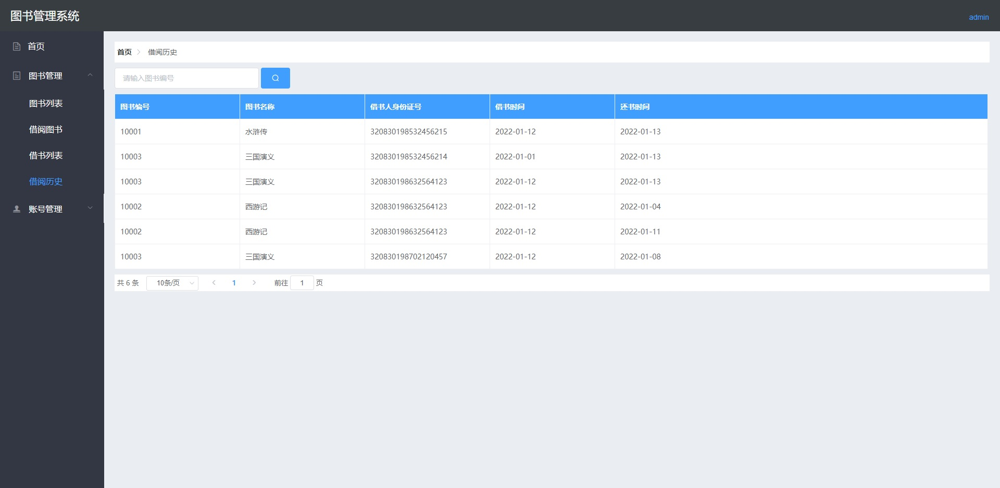
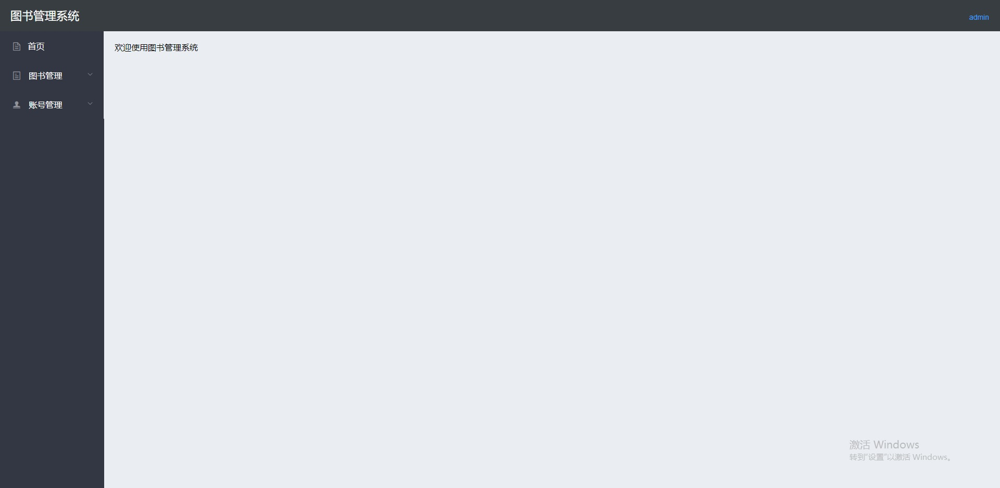
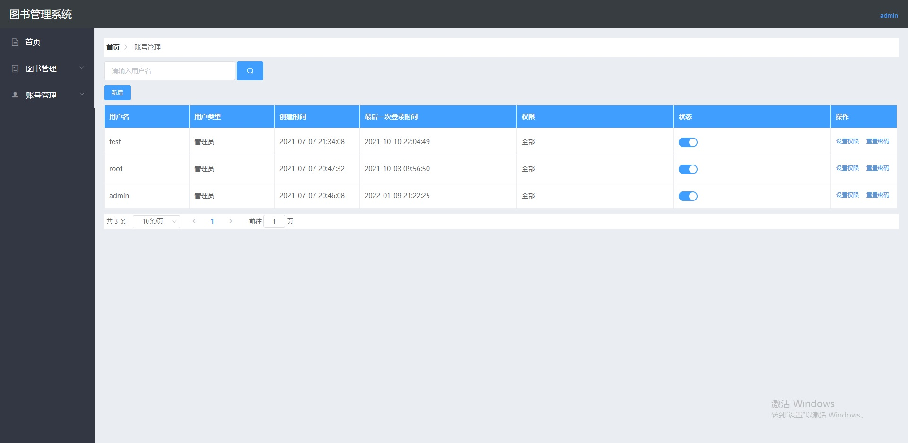
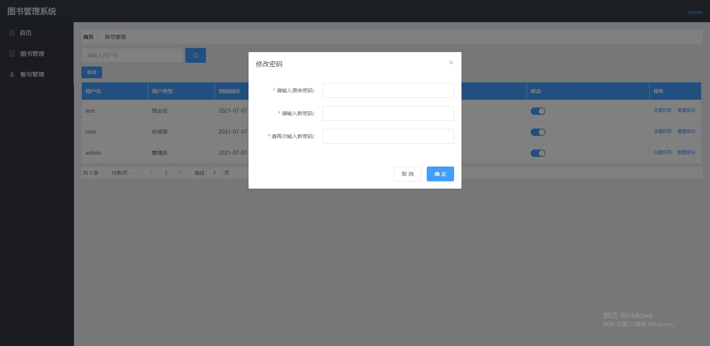
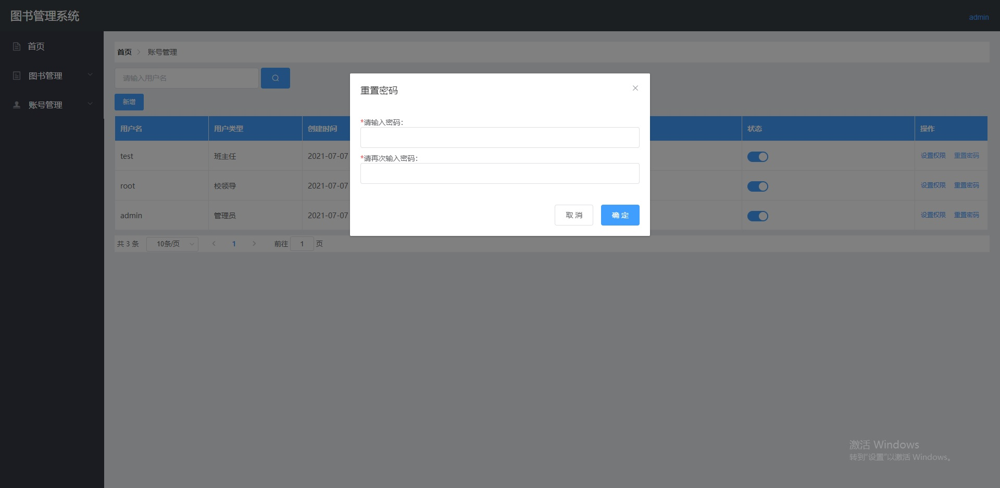

# edu-book

## 介绍

用于管理图书信息的一个系统，主要涉及的模块：登录、退出、图书管理、借阅图书、借阅图书列表、还书、系统账号管理。

## 软件架构

#### 前端技术

Vue Webpack Axios Element-UI Vuex

#### 后端技术

Springboot MybatisPlus PageHelper Hutool Redis Mysql

## 相关页面

#### 登录页面

#### 图书列表页面

#### 借阅图书页面

#### 借阅图书列表页面

#### 借阅历史

#### 首页

#### 系统账号列表页面

#### 修改密码、重置密码

## 联系方式

#### 手机

18994053761

#### 微信

